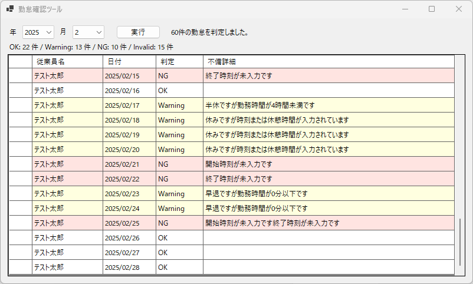

# ⏱ 勤怠管理チェックツール  
（人事・総務向け／入力不備チェック）

---

## このツールでできること

このツールは、  
**Googleスプレッドシートで管理している勤怠データに対して、  
入力ミスやルール違反がないかを自動でチェックする確認用ツール**です。

勤怠管理システムを新しく導入したり、  
今の運用を大きく変えたりする必要はありません。

**「今使っている勤怠スプレッドシートを、そのままチェックする」**  
ことを目的に作られています。

---

## こんな悩みはありませんか？

- 月末・月初の勤怠チェックに時間がかかる  
- 見落としが後から発覚して修正対応が大変  
- 人によって入力ルールがバラバラ  
- 同じ日付が二重で入力されている  
- 半休・早退なのに勤務時間が足りていない  
- 勤怠が未入力なのか、シート自体が無いのか分かりにくい  

このツールは、  
**そういった「人が目で見て確認している作業」を自動化**します。

---

## 主なチェック内容

### 入力不備のチェック
- 勤怠行が未入力
- 日付が未入力、または形式が不正
- 開始時刻・終了時刻が未入力
- 業務区分が不正、または空欄

👉 **どの従業員の、どの行に問題があるかが分かります**

---

### 業務ルールのチェック
- 同一従業員で同じ日付の勤怠が複数ある
- 半休なのに勤務時間が足りていない
- 早退なのに勤務時間が極端に短い

※ 休憩時間を考慮した実際の勤務時間で判定します

---

### 判定結果の分かりやすい表示
チェック結果は、以下の4種類で表示されます。

- **OK**：問題なし  
- **Warning**：注意が必要（確認推奨）  
- **NG**：明確な不備あり  
- **Invalid**：入力が不正、または勤怠情報が存在しない  

一覧画面では、  
**色分け表示＋不備内容の詳細表示**により、  
確認が必要な行が一目で分かります。  

---

## 安全性について（重要）

このツールは  
**勤怠データを「読むだけ」**のツールです。

- スプレッドシートへの書き込みは一切行いません  
- データを勝手に修正することはありません  
- 誤操作によるデータ破壊の心配はありません  

あくまで  
**「確認・チェック専用」**として安心して使えます。

---

## 使い方の流れ（簡単）

1. 年・月を選択
2. 「実行」ボタンを押す
3. 勤怠チェック結果が一覧表示される
4. Warning / NG / Invalid の行だけ確認・修正

👉 **人がやる作業は「確認と修正」だけ**

---

## 実務を想定した工夫

- 想定外の入力があってもアプリが落ちない
- 勤怠シートが無い場合も一覧に表示
- 「誰のデータか分からない」状態を作らない
- チェック結果はログとして記録されるため、後から確認可能

---

## 想定される利用シーン

- 月次締め前の最終チェック
- 勤怠管理システム移行前のデータ整理
- 人事・総務担当者の確認作業負担軽減
- 勤怠入力ルールの徹底・可視化

---

## まとめ

このツールは、

- 勤怠管理を置き換えるものではありません  
- 人の確認作業をゼロにするものでもありません  

**「人が見落としやすい部分を、先に機械が洗い出す」**  
ことで、  
確認作業を **早く・正確に・安心して** 行うためのツールです。

---

## 📫 お問い合わせ

業務内容に合わせたカスタマイズや、  
導入相談も可能です。

👉 [お問い合わせはこちら](../../contact/index.md)
