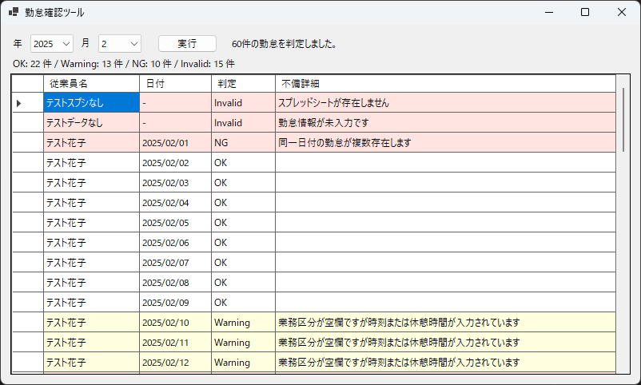
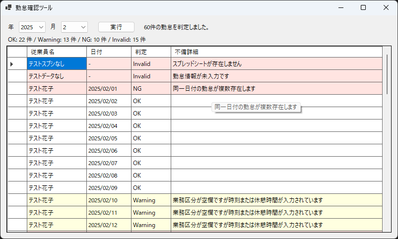
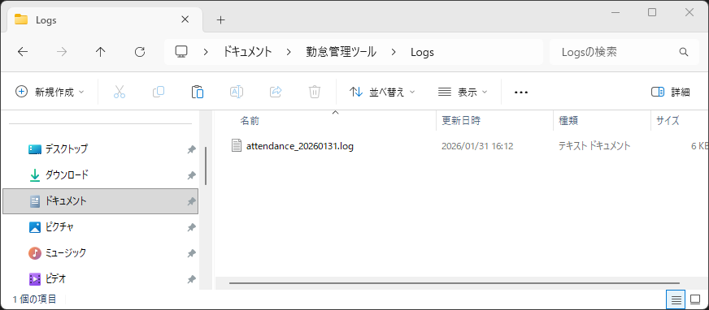
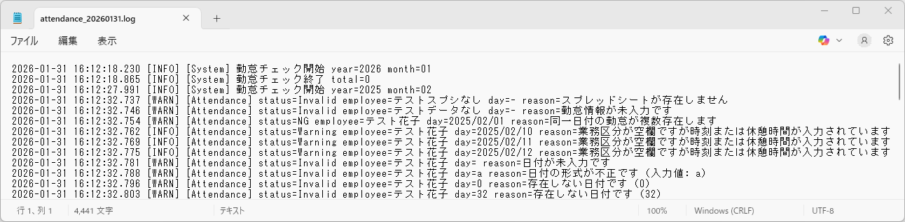

# ⏱ 勤怠管理チェックツール  
（WinForms × Googleスプレッドシート）

---

## 概要
Googleスプレッドシートで管理されている勤怠データを対象に、  
**入力不備・業務ルール違反を自動判定するチェック専用ツール**です。

既存の勤怠管理フローを変更せず、  
**「チェックだけを後付けで自動化する」**ことを目的として設計しています。

- 書き込み処理なし（読取専用）
- 既存スプレッドシート構成を前提
- WinForms によるシンプルなデスクトップ UI

---

## 🔒 公開範囲について
本ツールは、  
実運用を想定した Google Drive / Google Sheets API 連携を含むため、  
**一部の接続情報・認証情報は非公開**としています。

ポートフォリオ上では以下の内容を中心に公開・説明しています。

- 全体構成（UI / Service / Mapper / Judgment / Logging）
- 勤怠チェックルール設計
- 想定外入力・運用トラブルへの対応方針
- 動作確認チェックリスト
- ログ設計

実案件やご相談時には、  
**画面共有やデモ実行による動作説明が可能**です。

---

## 📸 スクリーンショット
- 勤怠チェック結果一覧（色分け表示）  

- 不備詳細ツールチップ表示  

- ログ出力（Logs フォルダ）  

※ スプレッドシートの内容はテストデータです。

---

## 主な機能

### 勤怠データ読取
- Google Drive 上の月別フォルダを探索
- 従業員フォルダ配下のスプレッドシートを自動取得
- 勤怠報告シート（指定シート名）から行データを読取

※ **書き込み処理は行わない安全設計**

---

### 入力不備チェック（Invalid）
- スプレッドシート未存在
- 勤怠行未入力
- 日付未入力・形式不正
- 業務区分不正値

---

👉 **どの従業員・どの行で問題が起きているかを特定可能**

---

### 業務ルールチェック
- 同一従業員・同一日付の重複勤怠（NG）
- 半休勤務時間不足（Warning）
- 早退勤務時間不足（Warning）
- 開始・終了時刻未入力（NG）

※ 休憩時間を考慮した実勤務時間で判定

---

### 業務区分の柔軟な扱い
- 通常勤務 / 有給 / 半休 / 休み / 早退
- **業務区分空欄（None）は「休み扱い」**
- 実務で起こりがちな入力揺れを許容

---

### UI 表示
- 判定結果一覧表示（OK / Warning / NG / Invalid）
- 判定種別ごとの行色分け
- 不備詳細はツールチップで表示
- 判定中ステータスメッセージ表示

---

### ログ出力
出力形式「yyyy-MM-dd HH:mm:ss.fff [LEVEL] [Category] Message」
- 処理開始・終了ログ
- 判定結果ログ（Warning / NG / Invalid）
- 例外ログ（スタックトレース付き）

---

👉 **運用時の調査・問い合わせ対応を想定した設計**

---

## 全体構成

### レイヤ構成
- **UI（WinForms）**
  - 入力受付
  - 結果表示
  - 例外通知
- **Service**
  - 月次処理オーケストレーション
  - スプレッドシート取得
  - 判定結果統合
- **Mapper**
  - スプレッド行 → Attendance 変換
  - 入力不正の検知
- **Judgment**
  - 勤怠ルール判定
- **Logging**
  - 業務ログ・例外ログ出力

---

## 設計上の工夫・配慮点
- 書き込みなし（安全性最優先）
- 想定外入力でもアプリが落ちない設計
- 不正入力でも **必ず一覧に表示**
- 従業員名＋日付で必ず特定可能
- 責務分離を意識した構成
- 実務での運用・保守を意識したログ設計

---

## 動作確認・テスト

### 実施済み
- スプレッド未存在
- 勤怠未入力
- 日付不正（数値以外）
- 同一日付重複
- 半休・早退判定（休憩考慮）
- 業務区分空欄
- UI 操作・ログ出力確認

※ 動作確認チェックリストを作成し、全項目確認済み

---

## 想定ユースケース
- 勤怠管理システム導入前のチェックツール
- スプレッドシート運用中の入力監査
- 月次締め前の勤怠不備洗い出し
- 人事・総務部門の確認補助

---

## 使用技術
- C# / WinForms
- Google Sheets API
- Google Drive API
- Service Account 認証

---

## 特徴まとめ
- **既存運用を壊さないチェック専用設計**
- **実務で起こる入力揺れを考慮**
- **不備を隠さず必ず可視化**
- **ログまで含めた運用設計**

---

## 補足
本ツールはポートフォリオ用途として作成していますが、  
実案件では以下の拡張が可能です。

- フィルタ機能（従業員／判定種別）
- CSV / Excel 出力
- 権限管理
- 定期実行・バッチ化
- ログ集約・監視連携

---

## 📫 お問い合わせ
お仕事のご相談はお気軽にどうぞ。

👉 [お問い合わせはこちら](../../contact/index.md)

GitHub: https://github.com/SakumaTakayuki  
X: https://x.com/sakuma_takayuki

