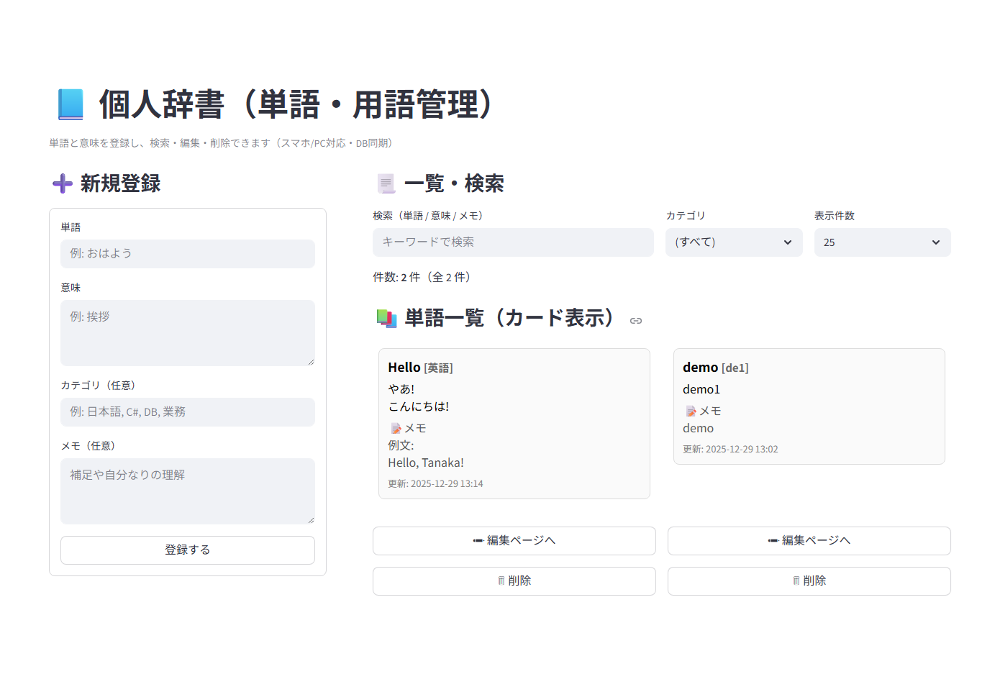
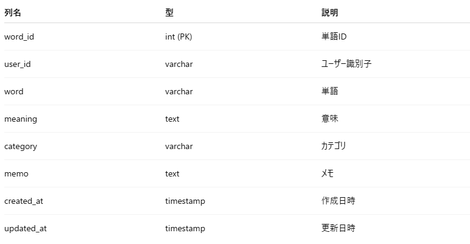
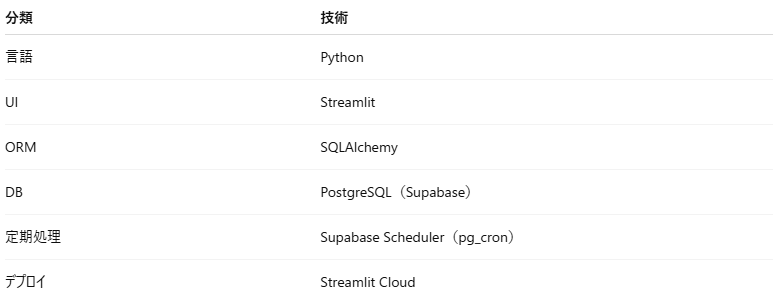

# 個人辞書（単語・用語管理）Webアプリ

業務・学習中に出てきた単語や用語を  
**クラウドDBに登録・検索・編集・削除できる個人向け辞書管理ツール**。

Streamlit を用いた軽量 UI と  
Supabase（PostgreSQL）を用いた永続データ管理を組み合わせ、  
**公開デモ運用を前提とした設計**を行っている。

---

## 概要



- 単語・意味・カテゴリ・メモを一元管理
- スマホ / PC 両対応
- クラウド DB によるデータ永続化
- 公開デモと本人利用を分離した設計

---

## 主な機能

- 単語 / 用語登録
- 意味・メモの複数行入力対応
- カテゴリ分類
- キーワード検索
- 編集・削除
- カード形式での一覧表示
- ユーザー別データ分離

---

## 想定利用シーン

- 業務中に出てきた専門用語の整理
- プログラミング学習時の用語管理
- 個人ナレッジの蓄積

---

## システム構成

[ Browser ]  
|  
[ Streamlit Cloud ]  
|  
[ SQLAlchemy ]  
|  
[ PostgreSQL (Supabase) ]  


---

## ユーザー設計

### ユーザー区分

- `owner`：本人利用用
- `demo`：公開デモ用

### 設計方針

- `words` テーブルに `user_id` 列を保持
- ログイン後、`user_id` をセッションに保持
- CRUD 操作時は常に `user_id` を条件に付与

```sql
SELECT *
FROM words
WHERE user_id = :user_id
ORDER BY updated_at DESC;
```
---

## データベース設計

### words テーブル


### デモデータ定期削除（運用設計）

公開デモ運用を想定し、  
**デモユーザーのデータのみを定期削除**する仕組みを導入。
- Supabase Scheduler（pg_cron）を使用
- 7日以上更新のないデモデータを削除

```sql
DELETE FROM words
WHERE user_id = 'demo'
  AND updated_at < now() - interval '7 days';
```

---

## 🛠 技術スタック



---

## プロジェクト構成
MyDictionary_App/  
├ app.py              # エントリポイント  
├ init_db.py          # DB初期化スクリプト  
├ db/  
│  ├ session.py       # DB接続設定（Single Source   of Truth）  
│  └ model.py         # SQLAlchemyモデル  
├ modules/  
│  ├ pages.py         # 画面ロジック  
│  ├ db_manager.py    # CRUD処理  
│  ├ dataclasses.py   # 入力データ定義  
│  └ utils.py         # 共通処理  
├ requirements.txt  
└ README.md

---

## セキュリティ・設定管理

- DB接続情報・認証情報は Secrets 管理
- `.env` はローカル専用（Git 管理外）
- Cloud 環境では Streamlit Secrets を使用
- アプリ起動時に DB 初期化処理は行わない設計

---

## デプロイ環境

- Streamlit Cloud（無料枠）
- Supabase（無料枠）
- アプリスリープ時も DB データは保持

---

## 💡 設計ポイント（こだわったところ）

- DB接続設定の一元化（session.py）
- 初期化処理と実行処理の責務分離
- 公開デモ運用を考慮したデータクリーンアップ
- UI 操作性と可読性を重視した構成

---

## 📁 公開URL

https://mydictionaryapp.streamlit.app/  
- ユーザー名: demo
- パスワード: demo_pass

---

## 補足

本ツールは  
**個人利用 + 公開デモ運用**の両立を目的に設計している。  

単なる CRUD サンプルではなく、  
**運用・セキュリティ・拡張性を意識した構成**を重視。

---

## 📫 お問い合わせ

お仕事のご相談はお気軽にどうぞ。

👉 [お問い合わせはこちら](../../contact/index.md)

GitHub: https://github.com/SakumaTakayuki  
X: https://x.com/sakuma_takayuki