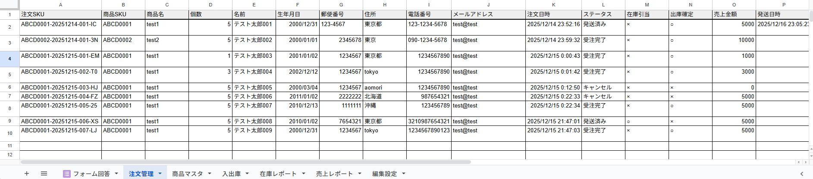
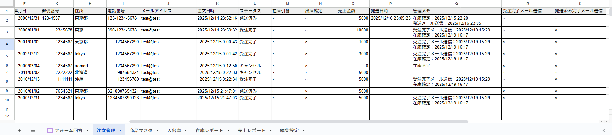

# 📦 注文・在庫管理ツール  
（Googleフォーム × Googleスプレッドシート）

---

## 概要
Googleフォームで受け付けた注文をもとに、  
**在庫引当・受注管理・発送管理・売上確認・通知メール送信**までを行う  
**小規模事業者向けの注文・在庫管理ツール**です。

Google Apps Script（GAS）を用いて構築しており、  
**在庫不整合やメール誤送信を防ぐ設計**を重視しています。

## 🔒 公開範囲について

本プロジェクトは、業務ロジックや運用設計を含むため、  
スプレッドシートおよび Google Apps Script の実装コードは  
ポートフォリオ上では公開していません。

代わりに、以下の点について README 内で詳細に説明しています。

- 全体構成（フォームGAS / スプレッドシートGASの役割分担）
- 在庫引当・出庫確定・キャンセル処理の設計方針
- 事故防止（同時実行・二重送信・在庫不整合）への対応
- テスト観点および確認済み項目

実案件やご相談時には、  
**画面共有やデモ環境を用いた動作説明が可能**です。

---

### 📸 スクリーンショット
以下は本ツールの構成が分かる一部画面です。

- 注文管理・在庫・売上を管理するシート構成  

- 状態管理・事故防止を考慮した列設計  

- 管理者向けカスタムメニュー  

※ 実装コードおよび詳細ロジックは非公開としています。

---

## 主な機能

### 注文受付
- Googleフォームから注文を受付
- フォーム送信時に在庫を確認
- 在庫不足時は注文を受け付けない制御  

※ 入力値については、  
Googleフォーム側の入力制御を前提とし、  
本ツールでは業務フローおよび在庫管理ロジックを重視しています。  

### SKU発番
- 注文ごとに一意な注文SKUを発番
- 日付＋連番方式による重複防止
- 初回データ0件時も正常動作

### 在庫管理
- 注文時に在庫引当
- キャンセル時は引当解除
- 受注完了後、在庫整理処理により出庫確定

### 在庫レポート
- 在庫数・引当数・出庫数は **スプレッドシート関数（SUMIFS）で算出**
- GASによる二重管理を避け、常に整合性を維持

### ステータス管理
- 管理者が注文ステータスを手動変更可能
- 自動処理と手動操作の責務を分離し、事故を防止

### メール通知
- 受注完了メール送信
- 発送完了メール送信
- 送信済みフラグ管理による二重送信防止

### 売上レポート
- 発送済データを基に、**日別の売上件数・売上合計を集計**
- 集計はスプレッドシート関数のみで実装し、シンプルかつ安全な構成

---

## 全体構成

### GAS構成
- **フォームGAS**
  - 商品プルダウン制御
  - 在庫切れ時のフォーム受付停止制御
- **スプレッドシートGAS**
  - 業務ロジック全般
  - 在庫引当・在庫整理
  - メール送信処理

  👉 **[GAS構成（ダミー）](GAS_STRUCTURE.md)**

### シート構成（抜粋）
- フォーム回答（編集不可）
- 注文管理
- 商品マスタ
- 在庫レポート（集計専用）
- 売上レポート（集計専用）
- 編集設定（競合防止フラグ）

---

## 自動処理と手動処理の役割分担

### 自動処理
- フォーム送信時処理（onFormSubmit）
  - 注文登録
  - 在庫引当
- 定時実行処理
  - ステータス進行
  - 受注完了メール送信
  - 在庫整理（引当解除・出庫確定）

### 手動処理（メニュー）
- 在庫整理の手動実行
- 受注完了メール送信の手動実行
- 発送メール送信

※ ステータス変更時に自動メール送信は行わず、  
　管理者の明示的な操作を前提としています。

---

## 事故防止・安定性への配慮
- ScriptLock による同時実行防止
- 編集中フラグによる管理者操作との競合回避
- 再試行処理による一時的失敗への耐性
- 冪等性を意識した設計（再実行安全）
- メール送信済みフラグによる二重送信防止

---

## テスト実施内容

### 実施済み
- TC-01：注文受付（初回データ0件含む）
- TC-02：在庫不足注文
- TC-03：連続注文
- TC-04：手動ステータス変更
- TC-05：在庫整理処理
- TC-06：受注完了メール送信
- TC-07：発送済みメール送信

### 設計上考慮（MVPのため実測省略）
- 在庫整理対象0件
- 編集中フラグ有効時の処理抑止
- 大量データ・高頻度同時実行

---

## 想定ユースケース
- 小規模EC
- 社内注文管理
- 期間限定商品の注文受付
- 在庫数が限られる業務

---

## 使用技術
- Google Apps Script
- Googleフォーム
- Googleスプレッドシート

---

## 特徴まとめ
- **在庫不整合を起こさない設計**
- **誤送信を防ぐ通知制御**
- **自動化と手動操作のバランス**
- **実務を意識したテスト・設計**

---

## 補足
本ツールはポートフォリオ用途として作成しており、  
実案件では要件に応じて以下の拡張が可能です。

- 権限管理
- CSV出力
- 外部システム連携
- 詳細ログ管理

---

## 📫 お問い合わせ

お仕事のご相談はお気軽にどうぞ。

👉 [お問い合わせはこちら](./contact/)

GitHub: https://github.com/SakumaTakayuki  
X: https://x.com/sakuma_takayuki